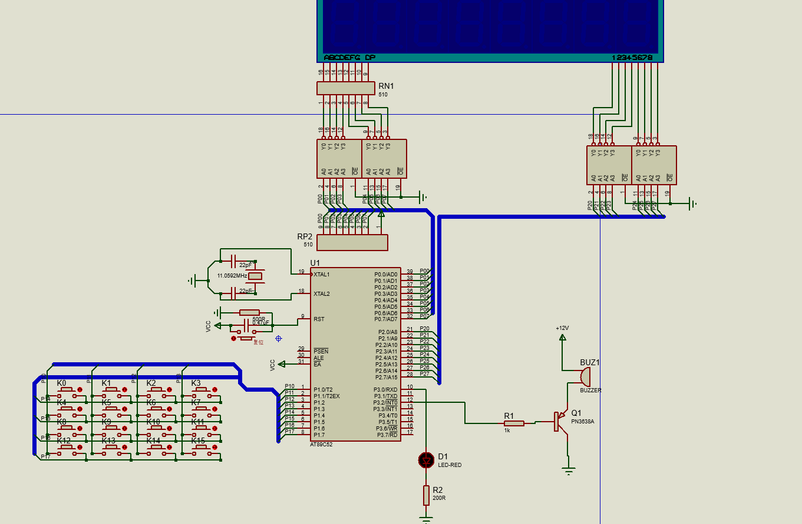

# 电子密码锁设计

## 1. 设计目的

### 1.1 目的
通过单片机应用产品的设计与调试过程，巩固《单片机技术应用》课程所学理论知识，初步了解单片机应用系统设计与调试的方法。

## 2. 设计任务

### 2.1 基本设计要求
设计一个以 AT89S51 单片机为核心的电子密码锁控制器，实现以下功能：

- 6位密码输入开锁、密码设置、时间修改等操作；
- 使用 8 位数码管作为操作过程的状态显示，平时显示时钟；
- 使用蜂鸣器和 LED 给出相关状态指示与报警。

### 2.1.1 开机自检
上电时，通过程序控制检查相关接口及数码管显示器、指示灯、蜂鸣器等外设是否正常。

### 2.1.2 平时显示时间
8 位数码管显示器平时显示时间，可通过按键设定时间。

### 2.1.3 行列式键盘
使用行列式键盘，主要的按键有：“0”~“9”用于输入时间数值和密码数字，“*”、“#”键用于显示切换、进入相应功能和设置状态。键盘扫描采取消抖动处理。

### 2.1.4 时钟设定
按下“#”键进入时钟设定界面，可修改时钟时间，并有超值域判别。

### 2.1.5 密码开锁
按下“*”键进入密码开锁状态，输入正确的密码后开锁，若密码错误，提供相应提示；连续错误 3 次后，警告并锁定。

### 2.1.6 密码设置
按两下“#”键进入密码设置界面，输入原密码和新密码，完成密码修改。

### 2.1.7 恢复出厂设置
通过设置在内部隐蔽位置的按钮恢复初始密码和时间。

### 2.2 扩展功能（选做）
- 显示、设定日期功能；
- 设定多组密码；
- 防偷窥密码的虚位密码功能。

## 3. 系统设计

### 3.1 硬件设计
硬件系统包括 AT89S51 单片机、数码管、矩阵键盘、蜂鸣器、LED 指示灯等外设。详细的电路图请参考项目中的原理图。

#### 仿真电路原理图：

#### 开发板适配电路：

### 3.2 软件设计

#### 3.2.1 开机自检
程序会初始化各外设，并通过自检界面显示相关状态。

#### 3.2.2 显示时间主界面
8 位数码管显示时间，用户可以通过按键设定。

#### 3.2.3 行列式键盘
键盘扫描功能，支持“0”~“9”的数字输入以及“*”和“#”键切换状态和菜单。

#### 3.2.4 时钟设定功能
进入时钟设定界面，按“#”键调整时间，修改后确认并更新时钟。

#### 3.2.5 密码开锁功能
输入密码进行开锁，密码正确则开锁，错误则给出警告并锁定 30 秒。

#### 3.2.6 密码设置
通过两次按下“#”键进入密码修改界面，用户可以修改密码。

#### 3.2.7 恢复出厂设置
通过按键 K0 实现系统恢复出厂设置，重置密码和时间。

### 3.3 扩展功能
- 显示和设定日期；
- 防偷窥密码的虚位密码功能；
- 可定制其他功能。

## 4. 系统功能实现与调试

### 4.1 各种功能展示与调试
系统已完成多种功能，包括开机自检、时间显示、密码开锁、时钟和密码设置等。

### 4.2 错误锁定与提示
如果密码连续错误 3 次，系统会播放警告声音并锁定 30 秒。

### 4.3 时间和日期修改
通过按键操作用户可以修改时间和日期，修改过程会自动巡回。

## 5. 总结

### 5.1 设计总结
本系统通过使用 AT89S51 单片机实现了电子密码锁的基本功能，涉及密码管理、时钟管理、外设控制等。设计过程中，使用了状态变量和计数器来完成不同功能的切换和显示。硬件设计和软件设计相辅相成，实现了系统功能的优化和稳定性。

